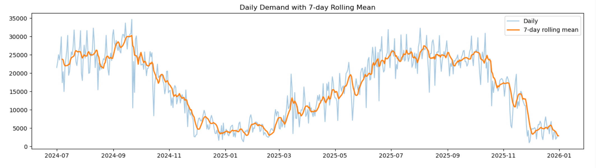
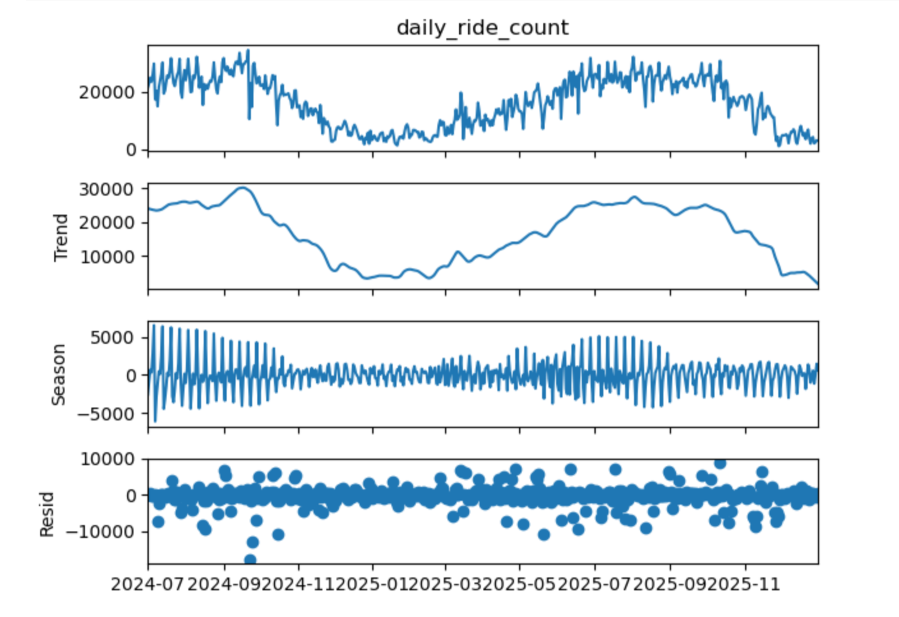
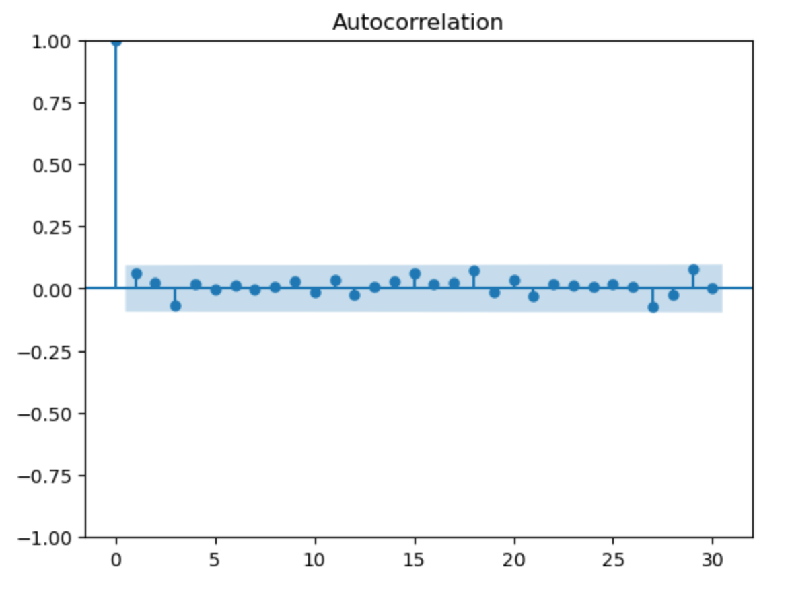
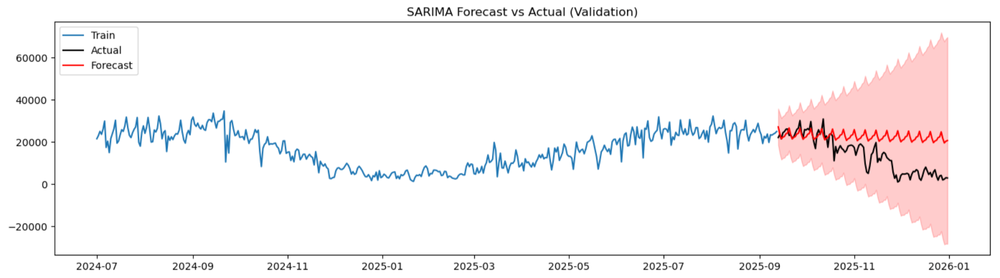

# Bike-Share Daily Demand Forecasting (SARIMA Baseline)

## Overview
This project builds an end-to-end, univariate time series pipeline to analyze and forecast **daily bike-share demand**. Starting from raw trip-level data, rides are cleaned and aggregated into a daily time series. The analysis uses **STL decomposition** to understand trend and seasonality, and fits a **SARIMA** model as an interpretable baseline for forecasting.

Key outcome: the SARIMA model captures short-term weekly seasonality well, but struggles to anticipate sharp winter demand drops—highlighting the need for exogenous drivers (e.g., weather) for regime shifts.

---

## Business Question
**How can we forecast daily bike-share demand to support operational planning (staffing, rebalancing, and capacity decisions), and what patterns drive demand over time?**

---

## Data
- Source: Public bike-share trip records (CSV files).
- Granularity: Trip-level records aggregated to daily demand.
- Note: Raw CSV files are not included in this repo due to size. See [`data/README_data.md`](data/README_data.md) for instructions.

---

## Methodology

### 1) Data Preparation
- Load multiple monthly CSV files
- Parse timestamps (`started_at`, `ended_at`)
- Remove invalid trips (missing timestamps, negative durations)
- Aggregate into daily metrics:
  - `daily_ride_count`
  - `avg_ride_length_min`

### 2) Exploratory Data Analysis (EDA)
- Visualize daily demand and 7-day rolling mean
- Apply **STL decomposition** to separate:
  - Trend
  - Seasonal (weekly)
  - Residual

### 3) Baseline Forecasting Model (SARIMA)
- Fit **SARIMA(p,d,q)(P,D,Q,s)** with **weekly seasonality (s=7)**
- Run residual diagnostics:
  - Residual plot
  - ACF plot
  - Ljung–Box test

### 4) Validation & Findings
- Forecast on a held-out validation period
- Weekly structure is captured well
- Winter demand collapse is under-estimated (a limitation of univariate models)

---

## Results (Figures)
Place your exported figures in `reports/figures/` and update filenames if needed:

- Daily demand + rolling mean  
  

- STL decomposition  
  

- Residual diagnostics (Residuals + ACF)  
  

- Forecast vs Actual (Validation)  
  

---

## SARIMA Model Summary (Concept)
**SARIMA** extends ARIMA by adding seasonal components:

- **AR (p):** dependence on past values  
- **I (d):** differencing to remove trend (non-stationarity)  
- **MA (q):** dependence on past forecast errors  
- **Seasonal terms (P, D, Q, s):** same ideas applied at a seasonal period `s` (here, 7 days)

**When to use SARIMA**
- Single time series with repeating seasonality (weekly/monthly)
- Need interpretability and a strong baseline
- Forecast horizon not dominated by external regime changes

**Limitation**
- Univariate SARIMA relies only on past demand and cannot anticipate shifts driven by exogenous factors (e.g., temperature/snowfall).

---

## Repository Structure
```text
data/        raw and processed data (raw not included)
notebooks/   analysis notebooks (01→03)
reports/     exported figures for README
src/         optional Python modules (if refactored)
